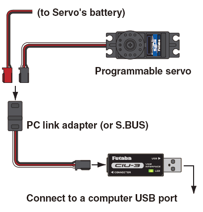
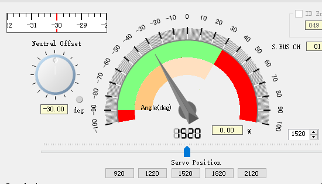

## FUTABA舵机调试

#### 调参线路连接

- 舵机型号：FUTABA BLS373SV无刷舵机；
- USB转接器：CIU-3；
- 通信协议：S.BUS；
- 上位机软件：S-Link；
- CIU-3的USB端接电脑，另外一端接舵机、舵机供电。

#### 默认参数配置

FUTABA舵机默认配置如下图所示。当舵机参数设置不合理时，舵机会出现抖动，此为正常现象，但长时间会损坏舵机，应及时将参数调整至合理范围。

#### 中立位置偏移（Neutral Offset）

在默认设置情况下，**中立位置偏移范围**：-32.0°~+31.75°。舵机中立位置偏移-30°后摆动范围如下图所示，绿色部分为舵机摆动范围（-90°-+30°）。

#### 转动角度范围（Travel Adjust）

1. 舵机**用手转动角度范围**：-90°~90°；

2. 舵机**默认转动范围**：-60°~60°，

   对应转动角度百分比：-100%~+100%，

   **PWM脉冲宽度范围**：920~2120us，1520us为中立位置；

3. **转动角度范围调整**：以中立位置为中心，舵机左摆、右摆范围可独立设置，调整范围为50%~149.6%；

4. 舵机Travel Adjust（左右摆动范围）分别设置为50%后，舵机摆动范围-30°~+30°，如下图所示；值得注意的是，舵机摆动至最左端、最右端对应的PWM占空比依然为920us和2120us。

   

#### 瞬时响应性能（Boost）

1. Boost设置范围：3%~45%；
2. Boost值设置小，舵机摆动平滑，瞬时响应性一般；Boost值设置大，舵机瞬时响应性好，摆动力矩大，但Boost值设置过大会导致摆动控制性能变差，引起舵机振动。

#### 死区角度设置（Dead Band）

1. 死区角度设置范围：0.00°~3.98°；
2. **死区角度设置小，舵机立刻响应微小的信号改变，响应性能好；但死区角度值过小，会引起舵机连续工作，增加工作电流，减少舵机使用寿命。**

#### 转动速度控制

1. 速度范围：12sec/60deg~0.047sec/60deg；
2. 舵机转动速度**不受**工作电压、负载力矩、电机差异等因素影响。

#### Damper Factor

1. Damper Factor设置范围：0~255；
2. Damper Factor值小，舵机摆动存在超调现象（overshoot），摆动超过指定位置然后往回摆动；Damper Factor值大，舵机摆动到指定位置前会提前刹车（brake），降低响应性。

#### Stretcher Gain

1. Stretcher Gain设置范围：x0.125~x8；
2. Stretcher Gain值越大，舵机转动至指定位置后的维持力矩越大，保持位置不变的能力越强。

#### 其他

1. 舵机PWM占空比对应摆动方向可以设置；
2. 舵机Smoothe功能一般设置开启；
3. 舵机自带蜂鸣器，当没有PWM信号时会报警。