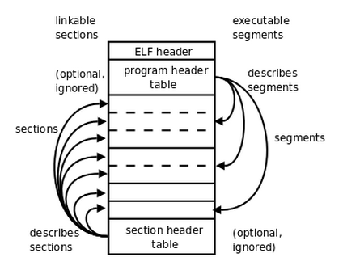

### x86汇编

x86汇编分为*Intel语法*和*AT&T语法*，**Unix平台汇编器使用AT&T语法**。

#### .c文件转换为二进制可执行文件

1. **预处理阶段**：预处理器（cpp）扩展源代码，插入#include命令指定的文件，并扩展所有#define声明的宏，此时.c文件变为.i文件；
2. **编译阶段：**编译器（ccl）将.i文件翻译成汇编代码.s文件；
3. **汇编阶段**：汇编器（as）将汇编代码转换为二进制**可重定位目标代码文件**；
4. **链接阶段：**链接器（ld）将目标代码文件与实现库函数（如printf）的代码合并，产生**可执行代码文件**。

#### 汇编符号

```
.section .data

.section .text
.global _start
_start:
movl $1, %eax  	# this is the Linux kernel command
				# number (system call) for exiting
				# a program
				
movl $4, %ebx	# this is the status number we will
				# return to the operating system.
				# change this around and it will
				# return different things to echo $?

int $0x80		# this wakes up the kernel to run 
				# the exit command
```

**“#”：**其后内容表示注释。

**“."：**其后指令为汇编指示或伪操作，不会被翻译为机器指令，而是给汇编器一些特殊提示。

​	**.section：**指示把代码划分为若干个段，程序被操作系统加载执行时，每个段被加载到不同地址。

​			**.data段：**保存程序的数据，可读可写，C程序全局变量。

​			**.text段：**保存程序的代码，可读可执行。

​	**_start：**该符号在汇编程序中代表一个地址，汇编程序在经过汇编器处理后，所有符号被替换为地址值。

​	**.global：**告诉汇编器符号_start要被链接器用到，需在生成的目标代码文件中标明该符号为全局符号。

> _start是汇编程序的入口，每个汇编程序均需提供并用.global声明。

​	**立即数前需加“$”，寄存器前需加“%”**，以便和符号名区分开。

​	**操作数赋值：**movl	源操作数	目标操作数

#### 寻址方式

**内存寻址格式：ADDRESS_OR_OFFSET(%BASE_OR_OFFSET, %INDEX, MULTIPLIER)**

**内存地址 = ADDRESS_OR_OFFSET + BASE_OR_OFFSET + INDEX * MULTIPLIER**

ADDRESS_OR_OFFSET必须是常数，MULTIPLIER必须是1、2、4或者8，BASE_OR_OFFSET和INDEX必须是寄存器。

```
movl ADDRESS %eax		# 直接寻址
movl 8(,%ebx,4), %eax	# 变址寻址，地址=8+ebx*4
movl (%ebx), %eax		# 间接寻址
movl 4(%ebx), %eax		# 基址寻址，地址=4+ebx
```

#### ELF文件

ELF文件格式为开放标准，分为三种类型：

- 可重定位的目标文件（Object File）
- 可执行文件（Executable）
- 共享库（Shared Object）

如下图所示，ELF文件提供两种视角：链接器把ELF文件看做Section的集合（链接视图），加载器把ELF文件看做Segment的集合（执行视图）。一个Segment可包含多个Section。

